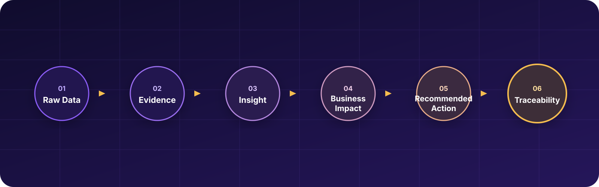
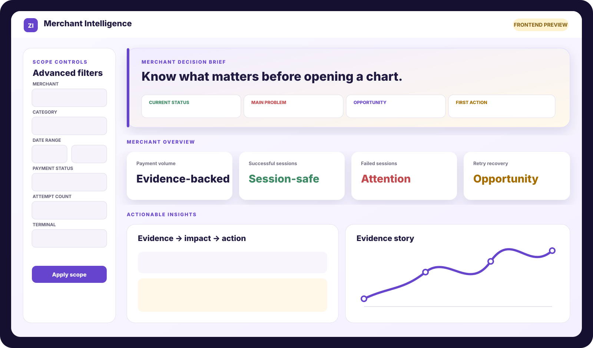
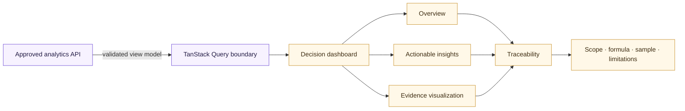

<div align="center">

# Zarinpal Merchant Intelligence

### Payment evidence, translated into confident merchant decisions.

[](https://react.dev/)
[](https://www.typescriptlang.org/)
[](https://vite.dev/)
[](https://pnpm.io/)


**[Product vision](docs/product/product-vision.md) · [Architecture](docs/frontend/frontend-architecture.md) · [Roadmap](docs/product/roadmap.md) · [Specification](SPEC.md)**

</div>

> [!IMPORTANT]
> The current interface is a frontend preview backed by clearly labelled illustrative fixtures. It does not present verified merchant analysis, calculate business metrics, or claim that `adjusted_fee` is Zarinpal's real fee.

## The idea

Payment data can explain what happened and still leave a merchant asking, “So what should I do?” This project closes that gap. It is a **decision-intelligence product**, not a wall of charts: every important finding moves from evidence to business meaning, a practical next step, and the context needed to verify the claim.



## Product tour



| Experience              | What the merchant gets                                                                        |
| ----------------------- | --------------------------------------------------------------------------------------------- |
| **Decision brief**      | The current status, highest-priority problem, opportunity, and first action before any chart. |
| **Merchant overview**   | Session-safe KPIs with explicit analytical units and direct evidence access.                  |
| **Actionable insights** | Observation → evidence → business impact → recommended action → limitations.                  |
| **Evidence story**      | One purposeful, keyboard-readable trend instead of decorative visualization.                  |
| **Segment comparison**  | Merchant-friendly comparisons that keep sample context and caveats visible.                   |
| **Traceability drawer** | Formula, scope, filters, period, sample size, missingness, provenance, and limitations.       |
| **Advanced filters**    | Clear scope controls on desktop and a touch-friendly sheet on smaller screens.                |

## What is implemented

- Responsive React dashboard with desktop, tablet, and mobile layouts
- Decision-first brief, metric overview, insight feed, trend visualization, and segment comparison
- Advanced merchant, category, date, status, attempt, amount, terminal, and issuer filters
- Evidence and traceability drawer with progressive disclosure
- Loading, empty, error, unavailable, and stale-data presentation states
- Accessible semantics, keyboard interaction, focus treatment, touch-safe controls, and reduced-motion support
- Strict TypeScript, ESLint, Prettier, Vitest, Testing Library, and a production build pipeline
- TanStack Query boundary ready for an approved analytics API

The analytical engine, dataset pipeline, backend, storage, and production API are intentionally outside this frontend-owned repository phase. Proposed integration shapes remain marked **DRAFT — REQUIRES TEAMMATE APPROVAL**.

## Architecture



### Frontend stack

| Layer        | Choice                                       | Why it is here                                   |
| ------------ | -------------------------------------------- | ------------------------------------------------ |
| UI           | React 19 + strict TypeScript                 | Predictable components and explicit contracts    |
| Build        | Vite 7                                       | Fast local feedback and production bundling      |
| Styling      | Tailwind CSS 4                               | Semantic tokens and responsive composition       |
| Components   | shadcn/ui-compatible source primitives       | Accessible, owned UI building blocks             |
| Server state | TanStack Query 5                             | A clean future API boundary                      |
| Quality      | Vitest + Testing Library + ESLint + Prettier | Behaviour, accessibility, types, and consistency |

## Quick start

### Prerequisites

- Node.js 22+
- pnpm 11+

```bash
git clone https://github.com/Fatima-Setayesh/zarinpal-merchant-intelligence.git
cd zarinpal-merchant-intelligence
pnpm install
pnpm dev
```

On Windows systems that block PowerShell shims, use `pnpm.cmd` in the same commands.

### Quality commands

| Command             | Purpose                                     |
| ------------------- | ------------------------------------------- |
| `pnpm dev`          | Start the Vite development server           |
| `pnpm lint`         | Run ESLint with zero warnings allowed       |
| `pnpm typecheck`    | Verify strict TypeScript contracts          |
| `pnpm test`         | Run the frontend test suite once            |
| `pnpm build`        | Type-check and create the production bundle |
| `pnpm format:check` | Check repository formatting                 |
| `pnpm check`        | Run every quality gate in sequence          |

## Correctness guardrails

```text
Payment Session != Payment Attempt
adjusted_fee      != Zarinpal's real fee
demo fixture      != verified merchant analysis
association       != causation
```

- Important claims must expose subset, filters, date range, sample size, formula, comparison groups, missing-data handling, and limitations.
- The frontend formats and explains backend-approved values; it does not calculate analytical results.
- A filter change must never leave stale claims looking current.
- Confidentially transformed fees may only support analytically justified relative comparisons.

## Repository map

```text
.
├── apps/
│   ├── web/                    # React application
│   │   └── src/
│   │       ├── app/            # Providers and application root
│   │       ├── components/     # Shared shell and UI primitives
│   │       ├── features/       # Dashboard, filters, insights, evidence
│   │       ├── routes/         # Merchant intelligence page
│   │       └── styles/         # Tokens and responsive behaviour
│   └── api/README.md           # Ownership-only backend placeholder
├── docs/
│   ├── frontend/               # UX, design system, architecture
│   ├── integration/            # Boundaries and draft contracts
│   ├── product/                # Vision, rubric, principles, roadmap
│   └── workflow/               # Team Git workflow
├── AGENTS.md                   # Repository operating contract
└── SPEC.md                     # Canonical product specification
```

## Documentation

| Product                                                  | Frontend                                                        | Integration                                                                    |
| -------------------------------------------------------- | --------------------------------------------------------------- | ------------------------------------------------------------------------------ |
| [Product vision](docs/product/product-vision.md)         | [Frontend architecture](docs/frontend/frontend-architecture.md) | [Frontend/backend boundaries](docs/integration/frontend-backend-boundaries.md) |
| [Judging rubric](docs/product/judging-rubric.md)         | [Design system](docs/frontend/design-system.md)                 | [Draft contracts](docs/integration/draft-contracts.md)                         |
| [Insight principles](docs/product/insight-principles.md) | [Traceability UX](docs/frontend/traceability-ux.md)             | [Git workflow](docs/workflow/git-workflow.md)                                  |
| [Roadmap](docs/product/roadmap.md)                       | [Responsive strategy](docs/frontend/responsive-strategy.md)     | [Demo checklist](docs/frontend/demo-checklist.md)                              |

## Delivery boundary

The repository deliberately separates presentation from analytical correctness. Fatima owns the frontend, UX, data storytelling, accessibility, traceability experience, and frontend integration. The teammate-owned analytical layer owns cleaning, session modelling, calculations, statistics, segmentation, backend APIs, storage, and numerical verification.

That boundary is a feature: it keeps every merchant-facing claim explainable without smuggling analytics into UI code.

---

<div align="center">

Built for the **Zarinpal Challenge** with one rule: **make the next decision clearer than the last chart.**

</div>
